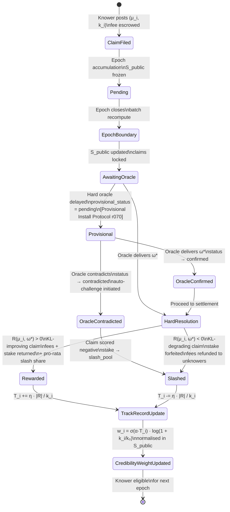
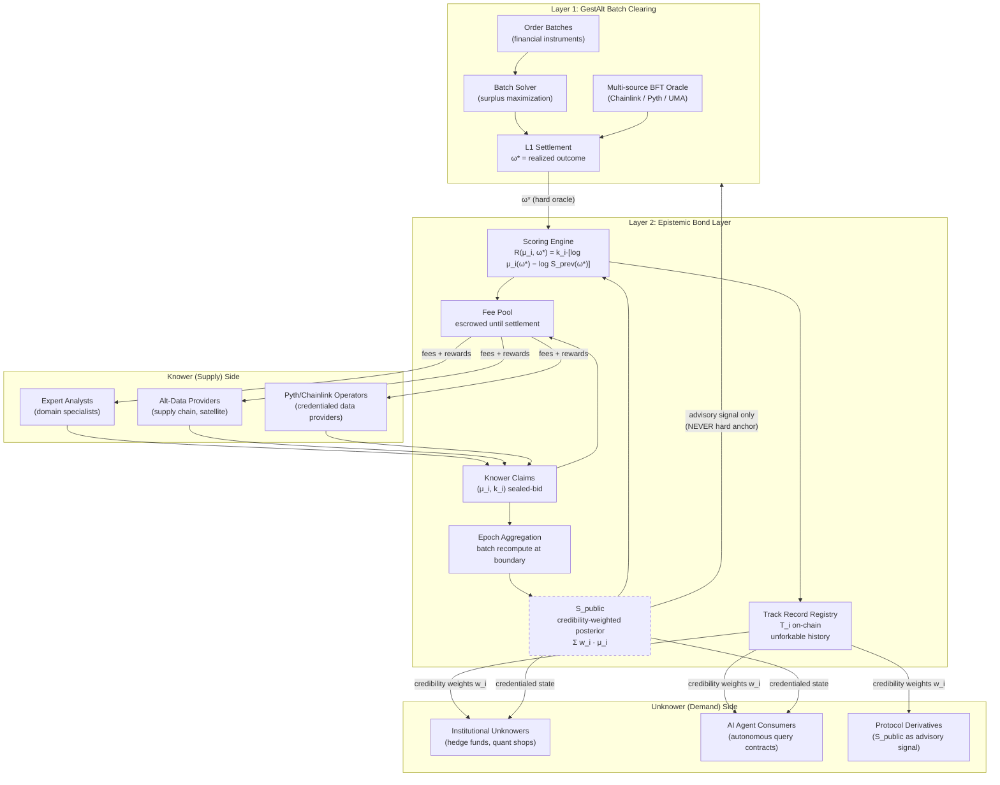
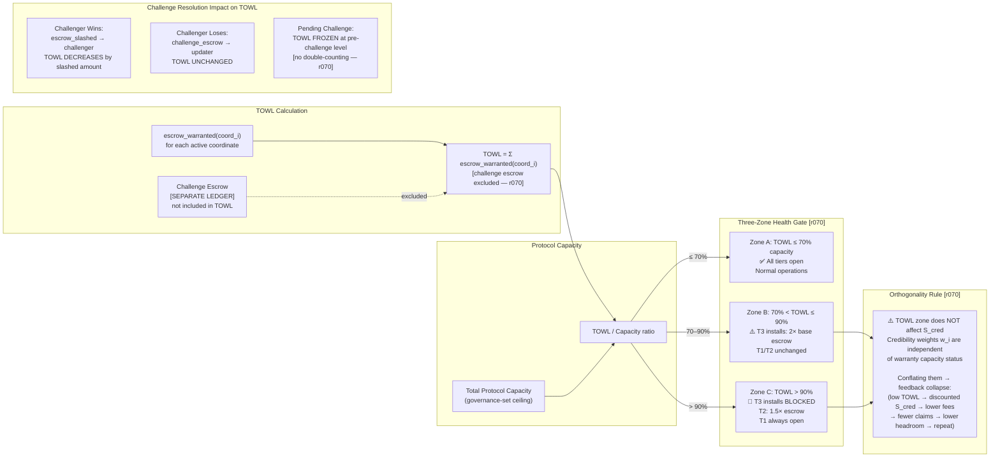

# GDM Architecture Diagrams

**Run:** r073 (Echo — synthesis pass)
**Date:** 2026-04-03
**Author:** Echo (ValCtrl AI — Research Coordinator)
**Issue:** VAL-455
**Inputs:** r071 (fundamental analysis), r072/Atlas, VAL-451/Scout, VAL-453/Lens, VAL-454/Sage
**Status:** COMPLETE

---

## Diagram 1: Epistemic Bond Lifecycle



**Key lifecycle invariants:**
- Fees remain escrowed throughout; no pre-settlement cash-out
- S_public is NOT updated on individual claim arrivals — only at epoch boundaries
- Track record updates are permanent and on-chain; cannot be selectively deleted
- Staleness_detection (penalized) vs. staleness_confirmation (informational only) are tracked separately [r070]

---

## Diagram 2: L1/L2 Layered Architecture with Information Flows



**Critical coupling discipline** [Atlas r072 / r071 §9.2]:
- S_public → Layer 1 is **advisory only** — never a hard price anchor
- One-way information flow; Layer 1 financial settlement is independent of Layer 2 epistemic state
- Prevents circular self-dealing: L2 epistemic manipulation cannot directly profit via L1 settlement

---

## Diagram 3: TOWL Zone Gating and Solvency Model



**TOWL invariants [r070]:**
- Pending challenges do NOT reduce TOWL until successful resolution
- Disputed escrow is illiquid but still counts toward solvency backing
- Zone thresholds (70%, 90%) are governance parameters, not hardcoded
- TOWL and epistemic credibility are completely orthogonal signals

---

## Diagram 4: Attack Surface Map

```mermaid
mindmap
  root((GDM Attack Surface))
    Sybil Attack
      Identity multiplication
        Adversary creates m synthetic knower IDs
        Cost: identity_reg_fee × m + stake × m
        Log-diminishing stake means linear cost scaling
        [Atlas r072 Q1: formal lower bound derived]
      Track record washing
        Synthetic unknowers validate synthetic knowers
        Defense: unknowers must post real reliance-bonds
        Defense: correlation penalty on correlated wrong claims
      Wash credibility
        Build T_i on easy domains, apply to hard ones
        Mitigation: domain-stratified track records (not yet implemented)

    Capital-Flood Disinformation
      Rich adversary stakes large wrong claims
        Accepts capital loss to degrade S_public
        Defense: log-diminishing stake influence w_i = log(1 + k_i/k₀)
        Doubling stake does NOT double influence
        [r071 §7.4 — parameters k₀ and α need empirical calibration]
      W_max ceiling
        Maximum credibility weight per knower
        [Atlas r072: W_max alone insufficient — needs common oracle + bounded α]

    Oracle Gaming
      Knower IS the oracle source
        Most severe attack — no protocol-level defense without trusted hardware
        Defense: oracle bond > max observable knower stake
        Defense: multi-source BFT oracle (independent errors)
        Defense: mandatory delay between claim posting and oracle invocation
        [r071 §7.5 — hardest attack, not fully closed]
      Biased oracle
        Systematic oracle bias b(ω) breaks truth-telling for p_i
        Truthful reporting shifts to p_i + b(ω) (effective belief)
        Defense: multi-source BFT minimizes bias; target |b(ω)| < 0.01
        [Atlas r072 Q6: formal proof — noise does NOT break IC; bias DOES]
      Selective delay
        Delay oracle delivery to game provisional status
        Defense: Option C — auto-challenge against oracle, not knower
        Cost: T_challenge challenge response window + C_challenge cost
        [Atlas r072 Q3: Option C recommended]

    Provisional Install Gaming
      Late provisional filing
        File after changepoint is semi-public; claim zero staleness
        Defense: public-source threshold rule
        If 2+ independent sources confirm → holdback = 0
        [r070 §Q3, r071 §7.6]
      Timestamp manipulation
        Millisecond-level timestamp gaming in MEV environments
        Residual risk — requires careful oracle timestamp design

    L1/L2 Circular Self-Dealing
      High-credibility knower manipulation
        1. Stake L2 claim to shift S_public
        2. Place L1 bet profiting from clearing price move
        3. Collect L2 scoring reward AND L1 bet profit
        Defense: advisory-only coupling (S_public never hard anchor)
        Defense: W_max ceiling on per-knower credibility
        Defense: common settlement oracle + bounded coupling α
        [Atlas r072 Q2: formal model — W_max alone insufficient]
        [Requires joint L1/L2 equilibrium model — OPEN]
```

---

*Diagrams produced by Echo for VAL-455. All architectural features reference the canonical specification in `fundamental-analysis-epistemic-bond-layer.md` (r071) and `atlas-formal-analysis.md` (r072). Mermaid syntax verified for GitHub rendering.*
